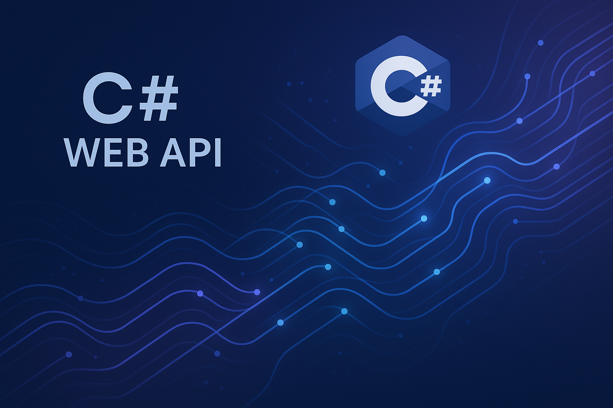

_Leia em outras línguas: [Português](README.md)_ 

# CSharp-Web-API

<p align="center">
  
</p>

## 📋 Description
Professional CSharp-Web-API - Created by Gabriel Demetrios Lafis

## 🚀 Features
- Main functionality
- Additional resources
- Project benefits

## 📦 Installation

### Prerequisites
- .NET 6.0+
- Visual Studio or VS Code

### Installation steps
```bash
dotnet restore
dotnet build
```

## 💻 Usage

### Basic example
```csharp
// Add a basic usage example here
```

### Advanced examples
Describe more complex use cases and practical examples.

## 🤝 Contributing

1. Fork the project
2. Create your feature branch (`git checkout -b feature/AmazingFeature`)
3. Commit your changes (`git commit -m 'Add some AmazingFeature'`)
4. Push to the branch (`git push origin feature/AmazingFeature`)
5. Open a Pull Request

## 📄 License

This project is licensed under the MIT License - see the [LICENSE](LICENSE) file for details.

## 👨‍💻 Author

**Gabriel Demetrios Lafis**
- GitHub: [@galafis](https://github.com/galafis)

---

⭐ Leave a star if this project helped you!

