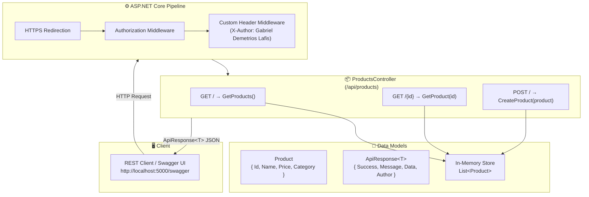
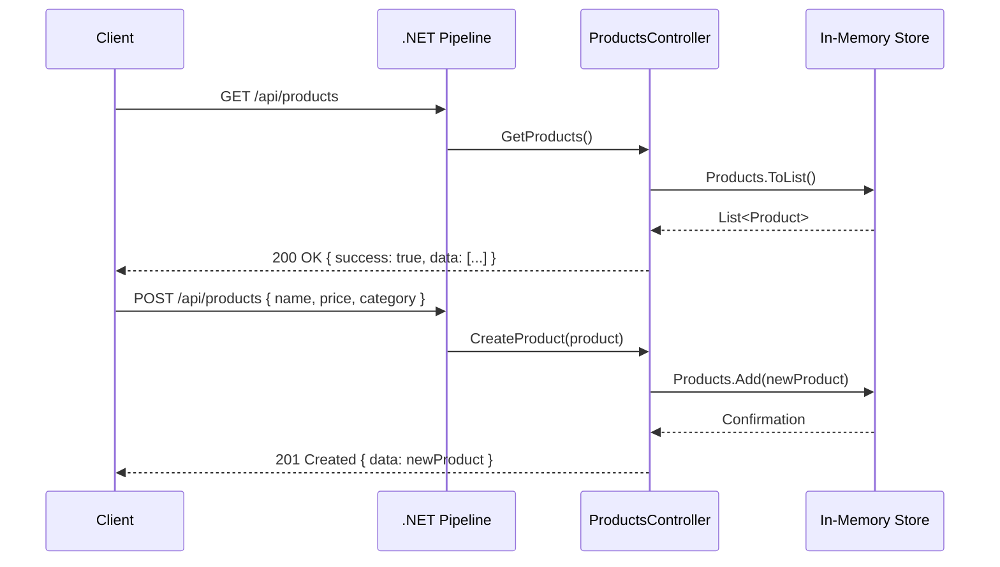

_Leia em outras línguas: [Português](README.md)_

# CSharp-Web-API

<p align="center">
  
</p>

[](https://dotnet.microsoft.com/)
[](https://learn.microsoft.com/en-us/dotnet/csharp/)
[](https://swagger.io/)
[](https://opensource.org/licenses/MIT)

RESTful Products API built with **C# and .NET 6**, following the MVC pattern with controllers, Swagger/OpenAPI support, and standardized responses via `ApiResponse<T>`.

---

## 🏗️ .NET API Architecture



---

## 🔄 Request Flow



---

## 📦 API Endpoints

| Method | Route                 | Description             | Success Status |
|--------|-----------------------|-------------------------|----------------|
| GET    | `/api/products`       | List all products        | 200 OK         |
| GET    | `/api/products/{id}`  | Get product by ID        | 200 OK / 404   |
| POST   | `/api/products`       | Create a new product     | 201 Created    |

### Payload Example (POST)

```json
{
  "name": "Headset",
  "price": 149.99,
  "category": "Electronics"
}
```

### Standard Response Format

```json
{
  "success": true,
  "message": "Product retrieved successfully",
  "data": {
    "id": 1,
    "name": "Laptop",
    "price": 999.99,
    "category": "Electronics"
  },
  "author": "Gabriel Demetrios Lafis"
}
```

---

## 🚀 Getting Started

### Prerequisites

- .NET 6.0 SDK or higher
- Visual Studio 2022 / VS Code / Rider

### Run the API

```bash
dotnet restore
dotnet build
dotnet run
```

- **API Base URL:** `http://localhost:5000`
- **Swagger UI:** `http://localhost:5000/swagger`

---

## 📂 Project Structure

```
CSharp-Web-API/
├── Controllers/
│   └── ProductsController.cs   # Controller with GET and POST endpoints
├── Program.cs                   # Pipeline and Swagger configuration
├── CSharp-Web-API.csproj        # .NET project definition
├── LICENSE
└── README.md
```

---

## 🛠️ Tech Stack

| Technology       | Role                         |
|------------------|------------------------------|
| .NET 6           | Runtime and web framework    |
| ASP.NET Core     | Web API framework            |
| C# 10            | Main language                |
| Swagger/OpenAPI  | Interactive API documentation |

---

## ✨ Future Improvements

- Add database support with Entity Framework Core (SQL Server / PostgreSQL).
- Implement JWT authentication.
- Add PUT and DELETE endpoints.
- Add validations with FluentValidation.
- Separate service and repository layers.

---

## 🤝 Contributing

1. Fork the project
2. Create your feature branch (`git checkout -b feature/AmazingFeature`)
3. Commit your changes (`git commit -m 'Add some AmazingFeature'`)
4. Push to the branch (`git push origin feature/AmazingFeature`)
5. Open a Pull Request

---

## 📄 License

This project is licensed under the MIT License — see the [LICENSE](LICENSE) file for details.

## 👨‍💻 Author

**Gabriel Demetrios Lafis**
- GitHub: [@galafis](https://github.com/galafis)
