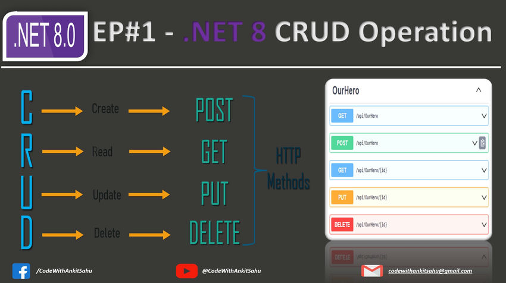
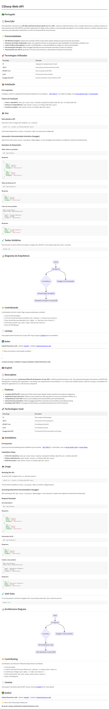

# CSharp-Web-API




## 🇧🇷 Português

## 📋 Descrição
Este repositório apresenta uma **API Web profissional desenvolvida em C# e .NET**, criada por Gabriel Demetrios Lafis. O projeto demonstra as melhores práticas no desenvolvimento de APIs RESTful, incluindo organização de código, testes unitários e documentação abrangente. É uma solução robusta e escalável, ideal para servir como base para aplicações corporativas ou como um componente de microsserviços.

## ✨ Funcionalidades
- **API RESTful Completa:** Implementa operações CRUD (Create, Read, Update, Delete) para gerenciamento de produtos.
- **Estrutura de Projeto Organizada:** Segue uma arquitetura limpa com separação de responsabilidades (Controladores, Modelos, etc.).
- **Testes Unitários Abrangentes:** Garante a confiabilidade e a manutenibilidade do código com testes automatizados.
- **Documentação Interativa:** Utiliza Swagger/OpenAPI para documentação automática e testes de endpoint.
- **Desenvolvido com .NET 8:** Aproveita os recursos mais recentes e o desempenho otimizado do framework.

## 🚀 Tecnologias Utilizadas

| Tecnologia | Descrição |
|---|---|
| **C#** | Linguagem de programação principal. |
| **.NET 8** | Framework para desenvolvimento da API. |
| **ASP.NET Core** | Para construção da API Web. |
| **xUnit** | Framework de testes unitários. |
| **Swagger/OpenAPI** | Para documentação e teste interativo da API. |

## 📦 Instalação

### Pré-requisitos
Certifique-se de ter as seguintes ferramentas instaladas em sua máquina:
- [.NET SDK 8.0](https://dotnet.microsoft.com/download/dotnet/8.0)
- Um editor de código, como [Visual Studio Code](https://code.visualstudio.com/) ou [Visual Studio](https://visualstudio.microsoft.com/pt-br/downloads/)

### Passos de Instalação
1.  **Clone o repositório:**
    ```bash
    git clone https://github.com/galafis/CSharp-Web-API.git
    cd CSharp-Web-API
    ```
2.  **Restaure as dependências:**
    ```bash
    dotnet restore src/CSharp-Web-API.csproj
    ```
3.  **Construa o projeto:**
    ```bash
    dotnet build src/CSharp-Web-API.csproj
    ```

## 💻 Uso

### Executando a API
Para iniciar a API, navegue até o diretório `src` e execute:
```bash
dotnet run --project src/CSharp-Web-API.csproj
```
A API estará disponível em `https://localhost:7000` (ou outra porta configurada).

### Acessando a Documentação Interativa (Swagger)
Após iniciar a API, acesse `https://localhost:7000/swagger` em seu navegador para explorar os endpoints e testá-los interativamente.

### Exemplos de Requisições

#### Obter todos os produtos
```http
GET /api/Products
```
**Resposta:**
```json
[
  {
    "id": 1,
    "name": "Laptop",
    "price": 999.99,
    "category": "Electronics"
  },
  {
    "id": 2,
    "name": "Mouse",
    "price": 29.99,
    "category": "Electronics"
  }
]
```

#### Obter produto por ID
```http
GET /api/Products/1
```
**Resposta:**
```json
{
  "id": 1,
  "name": "Laptop",
  "price": 999.99,
  "category": "Electronics"
}
```

#### Criar um novo produto
```http
POST /api/Products
Content-Type: application/json

{
  "name": "Teclado Mecânico",
  "price": 120.00,
  "category": "Electronics"
}
```
**Resposta:**
```json
{
  "id": 3,
  "name": "Teclado Mecânico",
  "price": 120.00,
  "category": "Electronics"
}
```

## 🧪 Testes Unitários
Para executar os testes unitários do projeto, navegue até o diretório `tests/CSharp-Web-API.Tests` e execute:
```bash
dotnet test
```

## 📊 Diagrama de Arquitetura




## 🤝 Contribuindo
Contribuições são bem-vindas! Siga os passos abaixo para contribuir:

1.  Faça um fork do projeto.
2.  Crie uma nova branch para sua feature (`git checkout -b feature/sua-feature`).
3.  Faça commit das suas alterações (`git commit -m 'Adiciona nova feature'`).
4.  Envie para a branch (`git push origin feature/sua-feature`).
5.  Abra um Pull Request.

## 📄 Licença
Este projeto está licenciado sob a Licença MIT. Veja o arquivo [LICENSE](LICENSE) para mais detalhes.

## 👨‍💻 Autor
**Gabriel Demetrios Lafis**
- GitHub: [@galafis](https://github.com/galafis)
- LinkedIn: [Gabriel Demetrios Lafis](https://www.linkedin.com/in/gabriel-demetrios-lafis/)

---

⭐ Deixe uma estrela se este projeto te ajudou!


" 


⫮

**A autoria de todo o trabalho é sempre atribuída a Gabriel Demetrios Lafis.**

## 🇬🇧 English

## 📋 Description
This repository presents a **professional Web API developed in C# and .NET**, created by Gabriel Demetrios Lafis. The project demonstrates best practices in RESTful API development, including code organization, unit testing, and comprehensive documentation. It is a robust and scalable solution, ideal for serving as a foundation for enterprise applications or as a microservice component.

## ✨ Features
- **Complete RESTful API:** Implements CRUD (Create, Read, Update, Delete) operations for product management.
- **Organized Project Structure:** Follows a clean architecture with separation of concerns (Controllers, Models, etc.).
- **Comprehensive Unit Tests:** Ensures code reliability and maintainability with automated tests.
- **Interactive Documentation:** Utilizes Swagger/OpenAPI for automatic documentation and endpoint testing.
- **Developed with .NET 8:** Leverages the latest features and optimized performance of the framework.

## 🚀 Technologies Used

| Technology | Description |
|---|---|
| **C#** | Main programming language. |
| **.NET 8** | Framework for API development. |
| **ASP.NET Core** | For building the Web API. |
| **xUnit** | Unit testing framework. |
| **Swagger/OpenAPI** | For interactive API documentation and testing. |

## 📦 Installation

### Prerequisites
Ensure you have the following tools installed on your machine:
- [.NET SDK 8.0](https://dotnet.microsoft.com/download/dotnet/8.0)
- A code editor, such as [Visual Studio Code](https://code.visualstudio.com/) or [Visual Studio](https://visualstudio.microsoft.com/downloads/)

### Installation Steps
1.  **Clone the repository:**
    ```bash
    git clone https://github.com/galafis/CSharp-Web-API.git
    cd CSharp-Web-API
    ```
2.  **Restore dependencies:**
    ```bash
    dotnet restore src/CSharp-Web-API.csproj
    ```
3.  **Build the project:**
    ```bash
    dotnet build src/CSharp-Web-API.csproj
    ```

## 💻 Usage

### Running the API
To start the API, navigate to the `src` directory and run:
```bash
dotnet run --project src/CSharp-Web-API.csproj
```
The API will be available at `https://localhost:7000` (or another configured port).

### Accessing Interactive Documentation (Swagger)
After starting the API, open `https://localhost:7000/swagger` in your browser to explore the endpoints and test them interactively.

### Request Examples

#### Get all products
```http
GET /api/Products
```
**Response:**
```json
[
  {
    "id": 1,
    "name": "Laptop",
    "price": 999.99,
    "category": "Electronics"
  },
  {
    "id": 2,
    "name": "Mouse",
    "price": 29.99,
    "category": "Electronics"
  }
]
```

#### Get product by ID
```http
GET /api/Products/1
```
**Response:**
```json
{
  "id": 1,
  "name": "Laptop",
  "price": 999.99,
  "category": "Electronics"
}
```

#### Create a new product
```http
POST /api/Products
Content-Type: application/json

{
  "name": "Mechanical Keyboard",
  "price": 120.00,
  "category": "Electronics"
}
```
**Response:**
```json
{
  "id": 3,
  "name": "Mechanical Keyboard",
  "price": 120.00,
  "category": "Electronics"
}
```

## 🧪 Unit Tests
To run the project's unit tests, navigate to the `tests/CSharp-Web-API.Tests` directory and run:
```bash
dotnet test
```

## 📊 Architecture Diagram


## 🤝 Contributing
Contributions are welcome! Follow the steps below to contribute:

1.  Fork the project.
2.  Create a new branch for your feature (`git checkout -b feature/your-feature`).
3.  Commit your changes (`git commit -m 'Adds new feature'`).
4.  Push to the branch (`git push origin feature/your-feature`).
5.  Open a Pull Request.

## 📄 License
This project is licensed under the MIT License. See the [LICENSE](LICENSE) file for more details.

## 👨‍💻 Author
**Gabriel Demetrios Lafis**
- GitHub: [@galafis](https://github.com/galafis)
- LinkedIn: [Gabriel Demetrios Lafis](https://www.linkedin.com/in/gabriel-demetrios-lafis/)

---

⭐ Leave a star if this project helped you!

**All work is always attributed to Gabriel Demetrios Lafis.**
