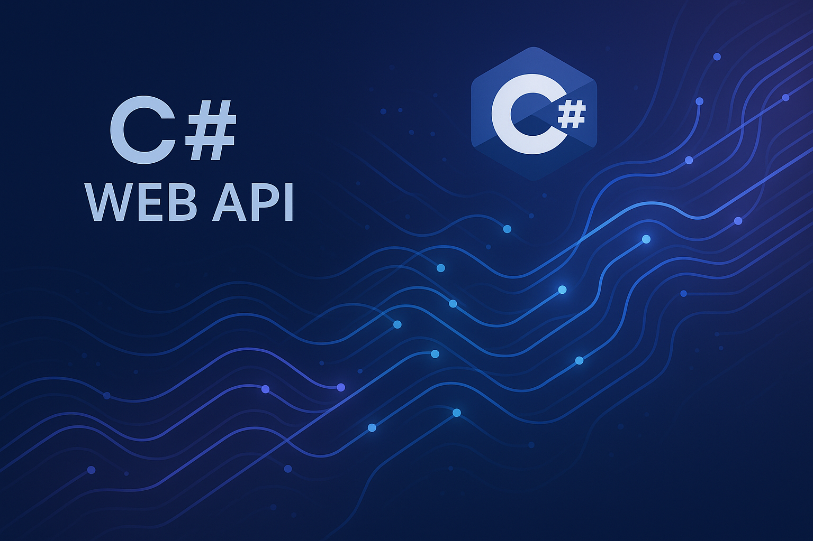
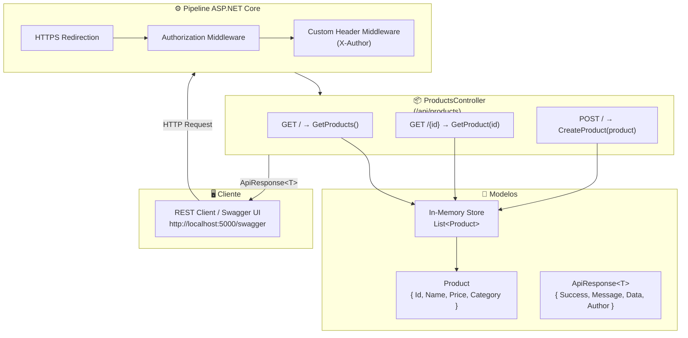
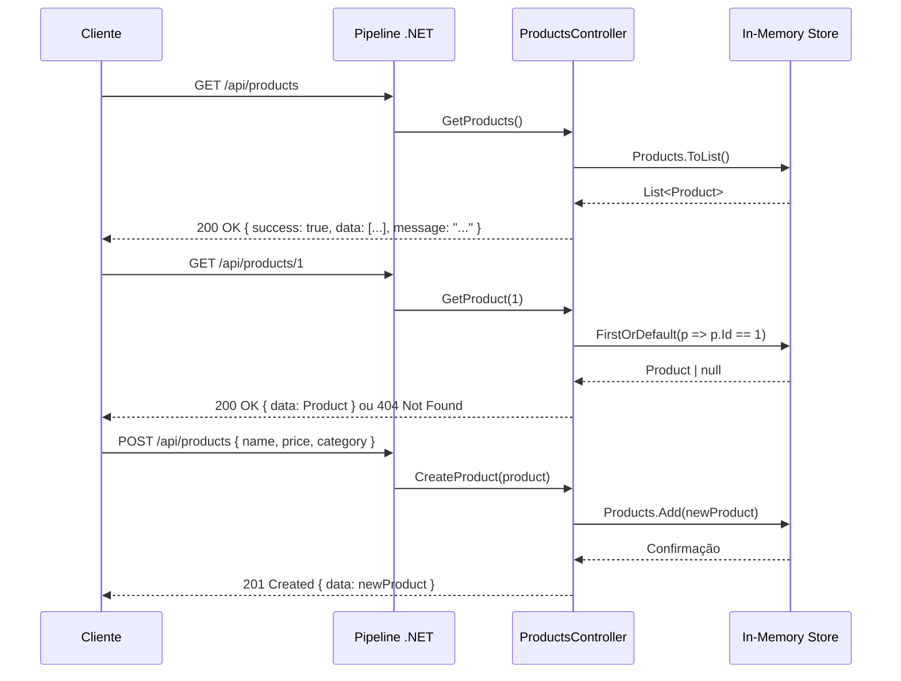
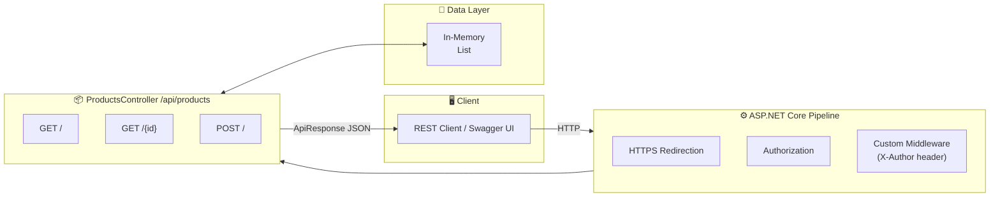

_Read this in other languages: [English](#-english)_

# CSharp-Web-API

<p align="center">
  
</p>


---

## 🇧🇷 Português

API RESTful de produtos desenvolvida em **C# com .NET 6**, seguindo o padrão MVC com controllers, suporte a Swagger/OpenAPI e resposta padronizada via `ApiResponse<T>`.

---

### 🏗️ Arquitetura da API .NET


```mermaid
graph TD
    subgraph Client["🖥️ Cliente"]
        REST["REST Client / Swagger UI\nhttp://localhost:5000/swagger"]
    end

    subgraph Middleware["⚙️ Pipeline ASP.NET Core"]
        MW1["HTTPS Redirection"]
        MW2["Authorization Middleware"]
        MW3["Custom Header Middleware\n(X-Author)"]
        MW1 --> MW2 --> MW3
    end

    subgraph Controller["📦 ProductsController\n(/api/products)"]
        GET_ALL["GET / → GetProducts()"]
        GET_ID["GET /{id} → GetProduct(id)"]
        POST["POST / → CreateProduct(product)"]
    end

    subgraph Model["📐 Modelos"]
        PROD["Product\n{ Id, Name, Price, Category }"]
        RESP["ApiResponse&lt;T&gt;\n{ Success, Message, Data, Author }"]
        STORE["In-Memory Store\nList&lt;Product&gt;"]
    end

    REST -->|"HTTP Request"| Middleware
    Middleware --> Controller
    GET_ALL --> STORE
    GET_ID --> STORE
    POST --> STORE
    STORE --> PROD
    Controller -->|"ApiResponse&lt;T&gt;"| REST
```

---

### 🔄 Fluxo de Requisição e Resposta


```mermaid
sequenceDiagram
    participant C as Cliente
    participant P as Pipeline .NET
    participant CT as ProductsController
    participant S as In-Memory Store

    C->>P: GET /api/products
    P->>CT: GetProducts()
    CT->>S: Products.ToList()
    S-->>CT: List<Product>
    CT-->>C: 200 OK { success: true, data: [...], message: "..." }

    C->>P: GET /api/products/1
    P->>CT: GetProduct(1)
    CT->>S: FirstOrDefault(p => p.Id == 1)
    S-->>CT: Product | null
    CT-->>C: 200 OK { data: Product } ou 404 Not Found

    C->>P: POST /api/products { name, price, category }
    P->>CT: CreateProduct(product)
    CT->>S: Products.Add(newProduct)
    S-->>CT: Confirmação
    CT-->>C: 201 Created { data: newProduct }
```

---

### 📦 Endpoints da API

| Método | Rota                  | Descrição                       | Status de Sucesso |
|--------|-----------------------|---------------------------------|-------------------|
| GET    | `/api/products`       | Lista todos os produtos         | 200 OK            |
| GET    | `/api/products/{id}`  | Busca produto por ID            | 200 OK / 404      |
| POST   | `/api/products`       | Cria novo produto               | 201 Created       |

### Exemplo de Payload (POST)

```json
{
  "name": "Headset",
  "price": 149.99,
  "category": "Electronics"
}
```

### Exemplo de Resposta Padrão

```json
{
  "success": true,
  "message": "Product retrieved successfully",
  "data": {
    "id": 1,
    "name": "Laptop",
    "price": 999.99,
    "category": "Electronics"
  },
  "author": "Gabriel Demetrios Lafis"
}
```

---

### 🛠️ Tecnologias

| Tecnologia          | Versão  | Função                              |
|---------------------|---------|-------------------------------------|
| .NET                | 6.0+    | Runtime e framework web             |
| ASP.NET Core        | 6.0     | Framework para Web APIs             |
| C#                  | 10+     | Linguagem principal                 |
| Swagger / OpenAPI   | 3.x     | Documentação e teste interativo     |

---

### 🚀 Como Rodar

#### Pré-requisitos

- .NET 6.0 SDK ou superior
- Visual Studio 2022 / VS Code / Rider

#### Execução

```bash
# Restaurar dependências
dotnet restore

# Compilar
dotnet build

# Executar
dotnet run
```

A API estará disponível em:
- **HTTP:** `http://localhost:5000`
- **Swagger UI:** `http://localhost:5000/swagger`

---

### 📂 Estrutura do Projeto

```
CSharp-Web-API/
├── Controllers/
│   └── ProductsController.cs   # Controller com endpoints GET e POST
├── Program.cs                   # Configuração do pipeline e Swagger
├── CSharp-Web-API.csproj        # Definição do projeto .NET
├── LICENSE
└── README.md
```

---

### ✨ Melhorias Futuras

- Adicionar banco de dados com Entity Framework Core (SQL Server / PostgreSQL).
- Implementar autenticação JWT.
- Adicionar endpoint PUT e DELETE.
- Adicionar validações com FluentValidation.
- Implementar camada de serviço e repositório separados.

---

### 📄 Licença

Este projeto está licenciado sob a Licença MIT — veja o arquivo [LICENSE](LICENSE) para detalhes.

### 👨‍💻 Autor

**Gabriel Demetrios Lafis**
- GitHub: [@galafis](https://github.com/galafis)

---

---

## 🇬🇧 English

RESTful Products API built with **C# and .NET 6**, following the MVC pattern with controllers, Swagger/OpenAPI support, and standardized responses via `ApiResponse<T>`.

---

### 🏗️ .NET API Architecture


```mermaid
graph LR
    subgraph Client["🖥️ Client"]
        REST["REST Client / Swagger UI"]
    end

    subgraph Pipeline["⚙️ ASP.NET Core Pipeline"]
        HTTPS["HTTPS Redirection"]
        AUTH["Authorization"]
        MW["Custom Middleware\n(X-Author header)"]
    end

    subgraph API["📦 ProductsController /api/products"]
        GA["GET /"]
        GI["GET /{id}"]
        PO["POST /"]
    end

    subgraph Data["📐 Data Layer"]
        STORE["In-Memory\nList<Product>"]
    end

    REST -->|HTTP| Pipeline
    Pipeline --> API
    API <--> STORE
    API -->|"ApiResponse<T> JSON"| REST
```

---

### 📦 API Endpoints

| Method | Route                 | Description             | Success Status |
|--------|-----------------------|-------------------------|----------------|
| GET    | `/api/products`       | List all products        | 200 OK         |
| GET    | `/api/products/{id}`  | Get product by ID        | 200 OK / 404   |
| POST   | `/api/products`       | Create a new product     | 201 Created    |

### Payload Example (POST)

```json
{
  "name": "Headset",
  "price": 149.99,
  "category": "Electronics"
}
```

### Standard Response Format

```json
{
  "success": true,
  "message": "Product retrieved successfully",
  "data": { "id": 1, "name": "Laptop", "price": 999.99, "category": "Electronics" },
  "author": "Gabriel Demetrios Lafis"
}
```

---

### 🚀 Getting Started

```bash
dotnet restore
dotnet build
dotnet run
```

- **API:** `http://localhost:5000`
- **Swagger UI:** `http://localhost:5000/swagger`

---

### 🛠️ Tech Stack

| Technology       | Role                         |
|------------------|------------------------------|
| .NET 6           | Runtime and web framework    |
| ASP.NET Core     | Web API framework            |
| C# 10            | Main language                |
| Swagger/OpenAPI  | Interactive documentation    |

---

### 📄 License

MIT License — see [LICENSE](LICENSE) for details.

### 👨‍💻 Author

**Gabriel Demetrios Lafis**
- GitHub: [@galafis](https://github.com/galafis)


---

## English

### Overview

CSharp-Web-API - A project built with C#, SQL, developed by Gabriel Demetrios Lafis as part of professional portfolio and continuous learning in Data Science and Software Engineering.

### Key Features

This project demonstrates practical application of modern development concepts including clean code architecture, responsive design patterns, and industry-standard best practices. The implementation showcases real-world problem solving with production-ready code quality.

### How to Run

1. Clone the repository:
   ```bash
   git clone https://github.com/galafis/CSharp-Web-API.git
   ```
2. Follow the setup instructions in the Portuguese section above.

### License

This project is licensed under the MIT License. See the [LICENSE](LICENSE) file for details.

---

Developed by [Gabriel Demetrios Lafis](https://github.com/galafis)
